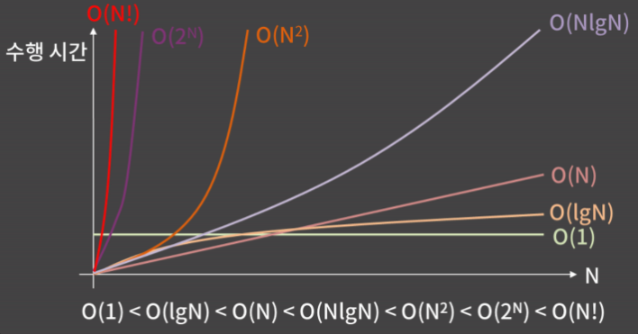
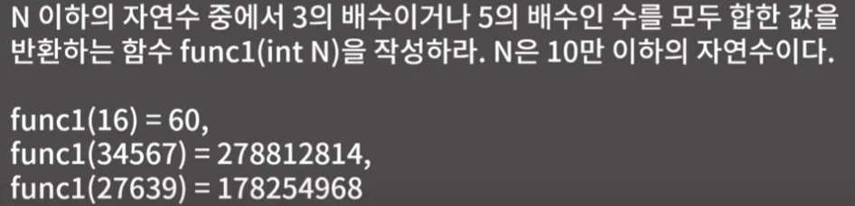

# 시간, 공간 복잡도

## 시간복잡도 (Time Complexity)

- 입력의 크기와 문제를 해결하는데 걸리는 시간의 상관 관계
    
    
    
    - 컴퓨터는 1초에 대략 3-5억개 정도의 연산을 처리할 수 있음
    - 5n + 3 → n에 비례한다라고 표현
    - 예시
        
        
        
        
        

## 빅오표기법 (Big-O Notation)

- 주어진 식을 값이 가장 큰 대표항만 남겨서 나타내는 방법
    
    
    
    - 입력되는 N의 크기에 따른 허용 시간복잡도 (대략적인 정리, 절대적이지는 않음)
        - 문제 풀때 내 풀이가 제한시간 내로 통과될 수 있는지, 내 알고리즘의 시간복잡도가 올바른지 꼭 생각하고 코딩해야 시간 낭비 안함
        
        
        

## 문제

- 문제 1 ~ 3
    
    ### 문제 1
    
    
    
    - 시간복잡도 : O(n)
    - 코드
        
        ```java
            public static int func1(int N) {
        
                int sum = 0;
        
                for(int i = 1; i <= N; i++) {
                    if(i % 3 == 0 || i % 5 == 0) sum +=i;
                }
        
                return sum;
        
            }
        ```
        
    
    ### 문제 2
    
    
    
    - 시간복잡도  O(n^2) - 내가 푼 방법
        - 이중 for문 사용
            - 공간복잡도 O(1)
                - 입력으로 주어진 배열 외 따로 자료구조 사용하지 않기때문에 추가 공간 사용 안함
        - 코드
            
            ```java
            		public static int func2(int[] arr, int N) {
            
                    for(int i = 0; i < N - 1; i++) {
                        for(int j = i + 1; j < N; j++) {
                            if(arr[i] + arr[j] == 100) return 1;
                        }
                    }
                    
                    return 0;
            
                }
            ```
            
    - 시간복잡도 O(n)
        - HashSet 사용
            - 공간복잡도 O(n)
        - 코드
            
            ```java
            		// 시간복잡도 O(n), 공간복잡도 O(n) 풀이 (값 범위가 클때도 사용 가능)
                public static int func2UsingHashSet(int[] arr, int N) {
            
                    HashSet<Integer> set = new HashSet<>();
            
                    for(int i = 0; i < N; i++) {
                        int complement = 100 - arr[i]; // 보완값
            
                        if(set.contains(complement)) {
                            return 1; // 합이 100 인 두 수가 존재
                        }
            
                        // 현재까지 값들 중 합이 100인 두 수 없을때
                        set.add(arr[i]); // 현재 값 저장
            
                    }
            
                    return 0; // 합이 100인 두 수가 존재하지않음
            
                }
            ```
            
    - 시간복잡도 O(n) - 가장 효율적
        - boolean 배열 사용
            - 공간복잡도 O(1)
            - boolean[101] → 고정 크기 이므로 상수 공간
        - 코드
            
            ```java
            		// 시간복잡도 O(n), 공간복잡도 O(1) 풀이 (값 범위가 좁을때 효율적)
                public static int func2UsingBooleanArr(int arr[], int N) {
                    boolean[] check = new boolean[101]; // 0~100 값 체크용
            
                    for (int i = 0; i < N; i++) {
                        int complement = 100 - arr[i]; // 보완값
            
                        if (complement >= 0 && complement <= 100 && check[complement]) {
                            return 1; // 합이 100인 두 수를 찾음
                        }
            
                        check[arr[i]] = true; // 현재 값 체크
                    }
            
                    return 0; // 못 찾음
                }
            ```
            
    
    ### 문제 3
    
    
    
    - 시간복잡도 O($\sqrt{n}$)
        - i * i 가 N 넘지 않을만큼만 순회
    - 오답노트
        - 처음에 for문 조건을 i ≤ N 으로 설정했었음
        - N이 10억이면 10억번 무조건 다 돎 → O(n) 시간복잡도
        - 제곱수 찾는 문제기 때문에 N 만큼 다 돌 필요 없음!!!
    - 코드
        
        ```java
        		public static int func3(int N) {
        
                for(int i = 1; i * i <= N; i++) {
                    if(i * i == N) return 1;
                }
        
                return 0;
        
            }
        ```
        
    
    ### 문제 4
    
    
    
    - 시간복잡도 O(logN)
        - N이 $2^k$ 이상 $2^{K+1}$ 미만 이므로 O(k) →  로그의 정의에 입각해서 k는 logN
        - Q. 왜 O(k) 가 O(log N) 이 되는지?
            - $2^k$ ≤ N → 양변에 $log_2$ 취함 → k ≤ $log_2N$
            - 빅오표기법에서 상수나 밑은 무시
            - 즉 O(k) = O(log N)
    - 오답노트
        - while 안에 if 를 작성해서 break 하지말고 while문 조건으로 작성하기
            
            ```java
            		public static int func4(int N) {
            
                    int multi = 1;
            
                    while(multi <= N) {
                        if(multi * 2 > N) break; // while 문안에 또 종료 조건을 따로 작성함
                        multi *= 2;
                    }
            
                    return multi;
            
                }
            ```
            
    - 코드
        
        ```java
        		public static int func4(int N) {
        
                int multi = 1;
        
        				// 2 곱한 수가 N보다 크면 더 곱하지 않고 종료
                while(2 * multi <= N) {
                    multi *= 2;
                }
        
                return multi;
        
            }
        ```
        

---

## 공간복잡도 (Space Complexity)

- 입력의 크기와 문제를 해결하는데 필요한 공간의 상관관계
    - 예시
        - 크기 N짜리 2차원 배열이 필요하면 O($N^2$)
        - 따로 배열 필요없으면 O(1)
    - 문제 메모리 제한 확인해서 풀기
        - 메모리 제한이 512MB =  1.2억개 int 변수 선언 가능
            - int 하나가 4바이트 이므로
        - 크기 5억인 int배열을 사용한 풀이를 생각했다면 메모리 제한 만족 못하므로 다른 풀이 구상
            - 5억 * 4바이트 = 2,000,000,000바이트 ≈ 1.86GB
        - 참고
            
            **단위 변환**
            
            - **1Byte**
            - **1KB = 1024B**
            - **1MB = 1024KB = 1,048,576B**
            - **1GB = 1024MB = 1,073,741,824B**
    - 코딩테스트에서 대부분은 시간복잡도 문제로 틀리긴함