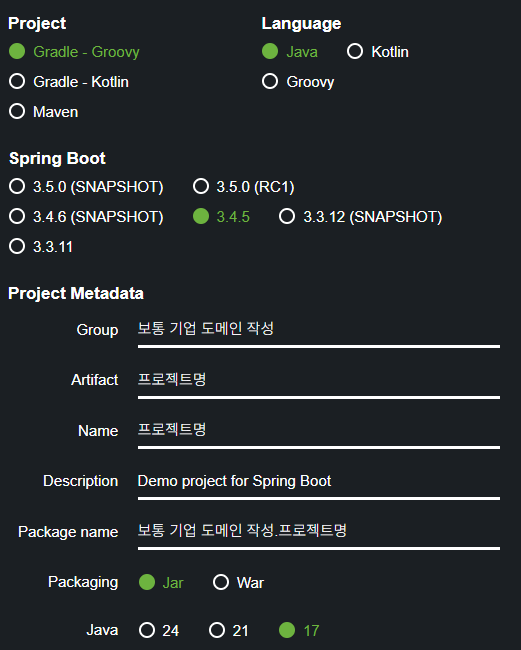

# 프로젝트 환경 설정

<br>

# 프로젝트 생성

## 사전 준비물

- Java 17 이상 설치
- IDE : IntelliJ 또는 Eclipse 설치

## 스프링 프로젝트 생성

1. 스프링 부트 스타터 사이트로 이동해서 스프링 프로젝트 생성
    - https://start.spring.io/
    - Gradle
        - 프로젝트 빌드 과정을 자동화하고, 필요한 외부 라이브러리(의존성)를 효율적으로 관리해줌
        - 개발 편의성을 높여주는 핵심도구




기본 프로젝트 생성 예시

- Project Dependencies
    
    
    
    프로젝트 생성 시 어떤 라이브러리 가져오고 시작할지 선택
    
    - Spring Web
        - Spring 웹 개발 라이브러리
    - Thymeleaf
        - HTML 만들어주는 템플릿 엔진
        - 다른거 사용하는 회사도 많음
1. Generate 버튼 눌러서 zip 파일 다운 받기
2. zip 파일 압축 해제하고 IntelliJ에서 해당 폴더 내 build.gradle 파일 선택해서 실행
    
    
    
3. 프로젝트 처음 오픈하면 라이브러리 한참 다운받음 - 다 끝나고 시작
4. build.gradle 파일 확인
    - [starter.spring.io](http://starter.spring.io) 에서 설정한 것들 작성되어있음
    - dependencies 라이브러리 mavenCentral 사이트에서 자동으로 다운받음
        - 원하면 다른 사이트 url로 수정 가능
    - JUnit5 는 기본 테스트 라이브러리
    
    ```java
    plugins {
    	id 'java'
    	id 'org.springframework.boot' version '3.4.5'
    	id 'io.spring.dependency-management' version '1.1.7'
    }
    
    group = 'hello'
    version = '0.0.1-SNAPSHOT'
    
    java {
    	toolchain {
    		languageVersion = JavaLanguageVersion.of(17)
    	}
    }
    
    repositories {
    	mavenCentral()
    }
    
    dependencies {
    	implementation 'org.springframework.boot:spring-boot-starter-thymeleaf'
    	implementation 'org.springframework.boot:spring-boot-starter-web'
    	testImplementation 'org.springframework.boot:spring-boot-starter-test'
    	testRuntimeOnly 'org.junit.platform:junit-platform-launcher'
    }
    
    tasks.named('test') {
    	useJUnitPlatform()
    }
    
    ```
    

1. 기본 빌드 Gradle 로 설정되어있는것 IntelliJ 로 변경
2. HelloSpringApplication 실행시키고 [localhost:8080](http://localhost:8080) 접속하면 성공
    - IntelliJ 내장 톰캣에서 실행됨 (embeded tomcat)

# 라이브러리 살펴보기

- Gradle은 의존관계가 있는 라이브러리를 함께 다운로드함
    - 프로젝트 생성 시 dependencies로 가져온건 두가지 밖에 없지만 실제 프로젝트 내 라이브러리 엄청 많음
    - 내가 고른 spring web, thymeleaf 에서 의존하는 라이브러리 까지 전부 gradle이 가져와주기 때문
    - spring boot 와 관련된 라이브러리를 쓰면 Spring Core 라이브러리 까지 전부 가져와서 세팅됨
    
    
    

## 스프링 부트 라이브러리

- Starter 의존성 하나만 추가해도 관련 라이브러리들이 자동으로 함께 따라오므로 호환성 걱정 없이 필요한 기능을 쉽게 추가할 수 있음
- spring-boot-start-web
    - spring-boot-starter-tomcat : 톰캣 (웹서버)
    - spring-webmvc : 스프링 웹 mvc
- spring-boot-starter-thymeleaf : 타임리프 템플릿 엔진 (View)
- spring-boot-starter (공통) : 스프링 부트 + 스프링 코어 + 로깅
    - spring-boot
        - spring-core
    - spring-boot-starter-logging
        - logback, slf4j

## 로그 라이브러리

- spring-boot-starter-logging
    - logback, slf4j


- 실무에선 로깅 프레임워크를 사용해서 디버깅 많이함
    - 실무에서 sysout 으로 출력하면 안됨
    - 왜?
        - 다양한 로그 레벨 및 파일 관리 용이
        - 메세지 중요도(레벨) 구분, 출력 위치(콘솔, 파일) 설정 등 sysout 보다 훨씬 다양한 기능 제공
        - 실제 서비스 운영 시 필수
- 그때 사용되는 라이브러리 - logging
- slf4는 인터페이스
- logback 은 실제 로그를 구현체로 출력 (다른 종류도 있는데 logback이 성능이 좋아서 기본으로 가져와짐)

## 테스트 라이브러리

- spring-boot-starter-test
    - junit : 테스트 프레임워크
    - mockito : 목 라이브러리
    - assertj : 테스트 코드를 좀 더 편하게 작성하게 도와주는 라이브러리
    - spring-test : 스프링 통합 테스트 지원


- JUnit5 가 메인 테스트 라이브러리
- assertj, mockito 등은 테스트 편리하게 도와주는 라이브러리

<br>

# View 환경설정

## Welcome Page 만들기

### 스프링 부트가 제공하는 Welcome Page 기능

- `resources/static/index.html` 을 올려두면 Welcome page 기능을 제공
- 아래 스프링 부트 기능 가이드에서 그때그때 검색해서 활용할 줄 알아야함
- [https://docs.spring.io/spring-boot/docs/2.3.1.RELEASE/reference/html/spring-boot-features.html#boot-features-spring-mvc-welcome-page](https://docs.spring.io/spring-boot/docs/2.3.1.RELEASE/reference/html/spring-boot-features.html#boot-features-spring-mvc-welcome-page)

[https://docs.spring.io/spring-boot/docs/2.3.1.RELEASE/reference/html/spring-boot-features.html#boot-features-spring-mvc-welcome-page](https://docs.spring.io/spring-boot/docs/2.3.1.RELEASE/reference/html/spring-boot-features.html#boot-features-spring-mvc-welcome-page)

## Thymeleaf 템플릿 엔진 사용

### 사용하는 이유

1. HTML 파일 그대로 브라우저에서 열어볼 수 있음
    - 정적 HTML로도 정상적으로 보임
    - 템플릿 문법이 HTML 주석이나 속성 형태이기 때문에, 디자이너와 협업이 쉬움
    - JSP는 브라우저에서 바로 열어보면 깨지지만, Thymeleaf는 괜찮음
2. Spring MVC와의 강력한 연동
    - Spring Boot + Thymeleaf 조합은 설정 없이도 바로 사용 가능
    - ${}로 모델 데이터 바로 바인딩 가능
    - URL 링크, form 처리, 메시지 출력 등도 Spring과 자연스럽게 연동
3. 표현력 좋은 문법 제공
    - th:text, th:each, th:if 등으로 HTML을 동적으로 생성
    - 반복문, 조건문, 변수 바인딩 등 쉽게 가능
    - 예시
        
        ```html
        <p th:text="${user.name}">기본 이름</p>
        ```
        

4. JSP보다 진보된 구조

- JSTL 태그, scriptlet (자바 코드) 없이도 로직 표현 가능
- HTML의 형태를 유지하면서도 동적 처리가 자연스러움
1. 템플릿 캐싱, 국제화, 폼 바인딩 등 다양한 기능
    - 메시지 번역, 날짜 포맷, 숫자 포맷 지원
    - Thymeleaf Layout Dialect로 템플릿 구조 분할(레이아웃)도 용이
    

### 참고

- thymeleaf 공식 사이트: [https://www.thymeleaf.org/](https://www.thymeleaf.org/)
- 스프링 공식 튜토리얼: [https://spring.io/guides/gs/serving-web-content/](https://spring.io/guides/gs/serving-web-content/)
- 스프링부트 메뉴얼: [https://docs.spring.io/spring-boot/docs/2.3.1.RELEASE/reference/html/spring-boot-features.html#boot-features-spring-mvc-template-engines](https://docs.spring.io/spring-boot/docs/2.3.1.RELEASE/reference/html/spring-boot-features.html#boot-features-spring-mvc-template-engines)

### 템플릿 엔진 동작 확인

1. java/../controller/HelloController 와 resources/templetes/hello.html 작성 후 실행

```java
package hello.hello_spring.controller;

import org.springframework.stereotype.Controller;
import org.springframework.ui.Model;
import org.springframework.web.bind.annotation.GetMapping;

@Controller
public class HelloController {

    @GetMapping("hello")
    public String hello(Model model) {

        model.addAttribute("data", "hello!!");
        return "hello";

    }

}

```

```html
<!DOCTYPE HTML>
<html xmlns:th="http://www.thymeleaf.org">
<head>
    <title>Hello</title>
    <meta http-equiv="Content-Type" content="text/html; charset=UTF-8"/>
</head>
<body>
<p th:text="'안녕하세요. ' + ${data}">안녕하세요. 손님</p>
</body>
</html>
```

1. 실행 : [http://localhost:8080/hello](http://localhost:8080/hello)
    
    
    
    실행 결과
    
- 동작 환경 그림
    
    
    
    - 전체 동작 구조 요약
        1. 웹 브라우저 요청
            - 사용자가 웹 브라우저에서 http://localhost:8080/hello로 접속
            - 이 요청은 Spring Boot 내장 톰캣 서버가 수신함
        2. DispatcherServlet  → 컨트롤러 매핑
            - 톰캣 서버는 요청을 Spring의 **DispatcherServlet**으로 전달함.
            - DispatcherServlet은 URL `/hello`에 해당하는 컨트롤러 메서드를 찾음.
            - HelloController.java 파일의 아래 메서드가 실행됨
                
                ```java
                @GetMapping("hello")
                public String hello(Model model) {
                    model.addAttribute("data", "hello!!");
                    return "hello";
                }
                ```
                
                - `model.addAttribute("data", "hello!!")`
                    - key: `"data"`
                    - value: `"hello!!"`
                    - 뷰에 전달할 데이터 모델 설정
                - `return "hello"`
                    - 뷰 이름(view name) 반환 (템플릿 파일 이름과 매칭)
        3. ViewResolver가 뷰 경로 결정
            - 스프링의 ViewResolver가 "hello"라는 뷰 이름을 다음 경로의 HTML 파일로 매핑함
                - src/main/resources/templates/hello.html
                - 이 경로는 Spring Boot에서 기본적으로 사용하는 템플릿 경로
                - 템플릿 엔진으로는 Thymeleaf가 자동 적용됨.
        4. Thymeleaf 템플릿 엔진이 HTML 렌더링
            - Thymeleaf는 hello.html 파일을 읽고, 템플릿 구문을 실제 데이터로 치환함
                
                ```html
                <p th:text="'안녕하세요. ' + ${data}">안녕하세요. 손님</p>
                ```
                
            - ${data}는 컨트롤러에서 전달한 "hello!!"로 치환됨
            - 최종 렌더링 결과
                - 이 HTML은 브라우저에 전달될 완성된 정적 HTML 문서임.
                
                ```html
                <p>안녕하세요. hello!!</p>
                ```
                
        5. 톰캣 서버 → 브라우저 응답
            - Thymeleaf가 렌더링한 HTML은 DispatcherServlet을 통해 톰캣 서버로 전달되고,
            - 톰캣 서버는 이를 최종적으로 브라우저에 응답함.
            - 사용자는 렌더링된 페이지를 브라우저에서 확인함.

### 참고

- spring-boot-devtools 라이브러리 추가하면, html 파일을 컴파일만 해주면 서버 재시작 없이 View 파일 변경 가능함
- IntelliJ 컴파일 방법 : 메뉴 build → Recompile

<br>

# 빌드하고 실행하기

## 윈도우 환경

### 빌드

1. 명령 프롬프트(cmd) 실행
2. 빌드하려는 프로젝트 폴더로 이동 (cd 프로젝트 폴더 경로)
    - 폴더 내에서 dir 쳐서 gradle.bat 파일 있는지 확인
3. `gradlew.bat build` 치고 엔터 → 빌드 성공
    - 윈도우는 gradlew build 또는 gradlew.bat build 둘 다 사용 가능
    - 맥/리눅스는 ./gradlew 사용
    
    
    

### 실행

1. dir로 build 폴더 있는지 확인
2. cd build (build 폴더로 이동) → dir (build 폴더 목록 나열)
3. cd libs (libs 폴더로 이동) → jar 파일 확인 가능
    
    
    
4. `java -jar hello-spring-0.0.1-SNAPSHOT.jar` 치고 엔터 → 실행 성공
    
    
    
5. [localhost:8080](http://localhost:8080) 접속해서 확인
    - IntelliJ 내부 톰캣 실행되있으면 포트 중복 사용되서 오류나니 반드시 하나씩 실행할것
6. 이와 같이 서버 배포 시 jar 파일만 복사해서 서버에 넣고  java -jar 로 실행하면 됨

### 참고

- 빌드 오류나면
    - `gradlew.bat clean build`  로 build 폴더 삭제 후 다시 빌드