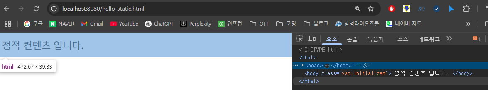

# 스프링 웹 개발 기초

<br>

# 정적 컨텐츠

- 스프링 부트는 정적 컨텐츠 기능 제공함
    - https://docs.spring.io/spring-boot/docs/2.3.1.RELEASE/reference/html/spring-boot-features.html#boot-features-spring-mvc-static-content

## 정적 컨텐츠 특징

- resources/static 폴더에 위치
- Controller 없이도 바로 브라우저에 반환됨
- 파일 그대로 반환됨 (렌더링/가공 없음)
    - HTML, CSS, JS, 이미지 등
- 빠르고 간단함 (템플릿이나 자바 코드 필요 없음)

## 예시



- hello-static.html 파일 생성 후 [localhost:8080/hello-static.html](http://localhost:8080/hello-static.html) 로 접속해서 확인
- 정적 컨텐츠 동작 이미지
    
    
    
    - 내장 톰캣이 요청 URL 수신 (`/hello-static.html`)
    - 매핑된 **Controller 있는지 먼저 탐색**
    - 없으면 `resources/static` 폴더에서 해당 파일 찾음
    - **찾은 정적 파일을 변환 없이 그대로 반환**

<br>

# MVC + 템플릿 엔진 (예: Thymeleaf)

## MVC

- Model, View, Controller
    - Controller와 View를 분리하는 이유
        - 옛날엔 한 jsp 파일에 같이 작성했으나 코드 길어지고 유지보수 어려움
        - 관심사 분리하고 코드의 유지보수성을 높이기 위해 분리

## 템플릿 엔진

- 정적인 HTML 파일에 동적인 데이터를 삽입해 최종 HTML로 만들어주는 도구
- Controller에서 전달받은 데이터를 HTML에 넣어줌
- Thymeleaf, Mustache, FreeMaker, JSP 등 원하는 것 사용
    - JSP는 최근에는 많이 안쓰임

## MVC + 템플릿 엔진 특징

- resources/templates에 위치
- Thymeleaf 등의 템플릿 엔진 사용
- Controller → Model 전달 → ViewResolver 처리 → 최종 HTML 렌더링
- 관심사 분리, 유지보수성 증가

## 정적 컨텐츠와 비교

| 구분 | 정적 컨텐츠 (/static) | MVC + 템플릿 엔진(/templates) |
| --- | --- | --- |
| 경로 | resources/static/ | resouces/templates/ |
| 반환 방식 | 그대로 반환
(변환 없음) | 템플릿 엔진으로 렌더링 후 반환 |
| 가공/동적 처리 | X (없음) | O (Model 데이터 바인딩 가능) |
| Controller 필요 | X (필요 없음) | O (필요) |

### 예시

- Controller
    
    ```java
    package hello.hello_spring.controller;
    
    import org.springframework.stereotype.Controller;
    import org.springframework.ui.Model;
    import org.springframework.web.bind.annotation.GetMapping;
    import org.springframework.web.bind.annotation.RequestParam;
    
    @Controller
    public class HelloController {
    
        @GetMapping("hello-mvc")
        public String helloMvc(@RequestParam("name") String name, Model model) {
            model.addAttribute("name", name);
            return "hello-template";
        }
    
    }
    ```
    
- View (Thymeleaf 템플릿)
    
    ```html
    <html xmlns:th="http://www.thymeleaf.org">
    <body>
    <p th:text="'hello ' + ${name}">hello! empty</p>
    </body>
    </html>
    ```
    

- 실행
    
    
    
    - [http://localhost:8080/hello-mvc?name=spring](http://localhost:8080/hello-mvc?name=spring)
    - hello-mvc 로 매핑된 메서드에서 name 이란 파라미터를 받아야한다고 지정해놨기 때문에 url 끝에 `?name=파라미터값` 적어줘야함
    - ViewResolver가 Thymeleaf 템플릿 엔진으로 처리해서 html로 변환 후 반환함
        - 정적 컨텐츠와 달리 템플릿 엔진으로 변환 후 반환함
- 동작 이미지
    
    
    
    - 정적 컨텐츠와 달리 viewResolver 가 템플릿 엔진 처리해서 html로 변환 후 반환

<br>

# API

## @ResponseBody 사용

### @ResponseBody 사용 특징

- ViewResolver를 사용하지 않고 HttpMessageConverter 동작
- 문자열이면 StringHttpMessageConverter, 객체면 MappingJackson2HttpMessageConverter
- JSON 기본 반환 방식으로 API 개발에 적합

### 문자 반환

- 템플릿 엔진을 사용하지 않고 @ResponseBody 어노테이션을 사용해 문자 반환
- 뷰 리졸버(viewResolver) 사용 안함
- 대신 HTTP body부에 내용을 직접 반환 (HTML <body> 태그 말하는 것 아님!)
- 예시
    - Controller
        
        ```java
        package hello.hello_spring.controller;
        
        import org.springframework.stereotype.Controller;
        import org.springframework.ui.Model;
        import org.springframework.web.bind.annotation.GetMapping;
        import org.springframework.web.bind.annotation.RequestParam;
        import org.springframework.web.bind.annotation.ResponseBody;
        
        @Controller
        public class HelloController {
        
            @GetMapping("hello-string")
            @ResponseBody
            public String helloString(@RequestParam("name") String name) {
                return "hello " + name; // "hello name값"
            }
        
        }
        
        ```
        
    - 실행
        
        
        
        
        
        
        - [http://localhost:8080/hello-string?name=zz](http://localhost:8080/hello-string?name=zz) 로 접속
        - 웹 표시되는건 mvc+템플릿 엔진과 다를것 없음
        - 그러나 페이지 소스 보면 html 코드 없이 컨트롤러 메서드에서 반환한 값만 나옴
        

### 객체 반환

- @ResponseBody 어노테이션을 사용하고, 객체를 반환하면 객체가 JSON으로 변환됨
- API 방식(특히 객체 반환)은 화면 구성보다는 필요한 데이터 자체를 JSON과 같은 형식으로 클라이언트에 보내주는데 중점을 둠
- 예시
    - Controller
        
        ```java
        package hello.hello_spring.controller;
        
        import org.springframework.stereotype.Controller;
        import org.springframework.ui.Model;
        import org.springframework.web.bind.annotation.GetMapping;
        import org.springframework.web.bind.annotation.RequestParam;
        import org.springframework.web.bind.annotation.ResponseBody;
        
        @Controller
        public class HelloController {
        
            @GetMapping("hello-api")
            @ResponseBody
            public Hello helloApi(@RequestParam("name") String name) {
                Hello hello = new Hello();
                hello.setName(name);
                return hello;
            }
        
            static class Hello {
                private String name;
        
                public String getName() {
                    return name;
                }
        
                public void setName(String name) {
                    this.name = name;
                }
        
            }
        
        }
        
        ```
        
        - getter / setter 로 Hello 객체 private 변수 접근
            - Java Bean 표준 방식 이라함
            - 프로퍼티 접근 방식 이라고도 함
    - 실행
        
        
        
        - [http://localhost:8080/hello-api?name=spring2](http://localhost:8080/hello-api?name=spring2) 으로 실행
        - 기존과 달리 JSON 으로 보여짐
            - JSON
                - {key:value}로 이루어진 자바스크립트 객체 표기법
                - 일반적으로 서버에서 클라이언트로 데이터를 보낼때 사용하는 양식
        - html 태그와 같이 보여지는걸 xml 방식이라함 (옛날 방식)
        - 최근에는 JSON으로 반환하는게 기본임
        
- @ResponseBody 사용 원리
    
    
    
    1. @ResponseBody 를 사용
    2. hello-api로 매핑된 컨트롤러 메서드 찾음
    3. 찾았는데 메서드에 @ResponseBody 어노테이션이 붙어있으면
    4. 템플릿을 찾지 않고 HTTP의 BODY에 문자 내용을 직접 반환
        - viewResolver 대신에 HttpMessageConverter 가 동작
        - 반환값이 문자 라면
            - StringHttpMessageConverter 가 처리해서 문자 그대로 반환
        - 반환값이 객체 라면
            - MappingJackson2HttpMessageConverter 가 처리해서 JSON 으로 변환 후 반환
                - Jackson은 객체를 JSON 으로 변환해주는 대표적인 라이브러리 중 하나
                - 또 다른 하나는 구글에서 만든 Gson
                - 스프링은 Jackson 2버전 라이브러리를 기본적으로 탑재함
        - byte 처리 등등 기타 여러 HttpMessageConverter가 기본으로 등록되어 있음

- 참고
    - 클라이언트의 HTTP Accept 해더와 서버의 컨트롤러 반환 타입 정보를 조합해서
    `HttpMessageConverter` 가 선택된다.
    - 일단 실무에선 객체는 JSON 반환이 기본

<br>

# 정리

- 스프링 웹 개발의 세가지 주요 방식 각각의 반환 형태
    - 정적 컨텐츠
        - 가공되지 않은 파일
    - MVC
        - 처리된 HTML
    - API
        - 데이터